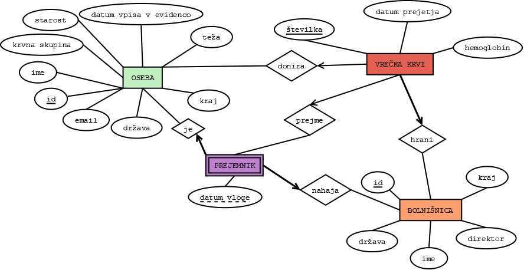

# Krvna-banka
## Projekt pri OPB 2018/19

Aplikacija nelogiranim uporabnikom omogoča pregledovanje zaloge krvi glede na krvno skupino in lokacijo bolnišnice. Uporabnik pa se lahko tudi logira kot zdravnik z določenim uporabniškim imenom in geslom. Pri tem ima prav tako dostop do pregleda zaloge krvi, pregleduje lahko tudi opravljene donacije in tako izvedene kot neizvedene vloge za prejem krvi ter prejemnike (paciente) v bolnišnicah. Zdravnik ima tudi funkcijo vpisa noveg donatorja v sistem preko obrazca.

Zdravnik se vpiše kot:
up. ime: zdravnik
geslo: krvnabanka187

 
